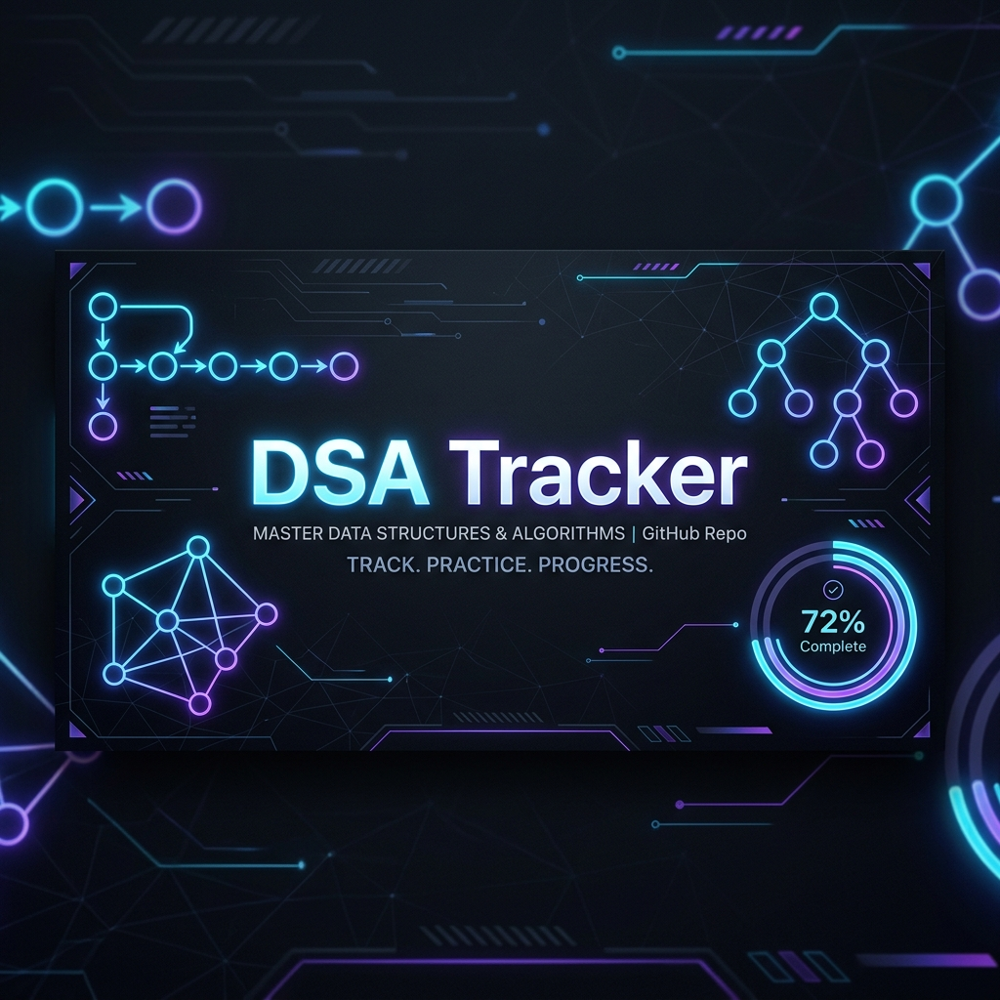

# 🧠 DSA Pattern Tracker



A high-performance, premium, and fully responsive **Data Structures & Algorithms (DSA) Pattern Tracker** designed to help developers systematically master coding interviews in 4 weeks. 

This repository is structured as a ready-to-use static web application that tracks your progress through **20 essential coding patterns** and **100 hand-picked challenges**. It runs directly in the browser with offline-first local storage support.

---

## ✨ Key Features

- **4-Week Structured Plan**: Curated roadmap focusing on Array & String, Search, Heap & Graphs, Backtracking, and Advanced DP patterns.
- **Interactive Dashboard**:
  - **Dynamic SVG Progress Ring**: Visualizes completion percentage in real-time.
  - **Difficulty Distribution bar**: Color-coded segments showing solved Easy (green), Medium (yellow), and Hard (red) questions.
  - **Active Stage Identifier**: Automatically monitors your current weekly milestone.
- **Embedded Python3 Solutions**: Click any problem name to slide down a syntax-styled solution drawer, ready to copy with a single tap.
- **Resources Linked**: Fast links to LeetCode workspace and custom YouTube video walkthroughs for every single problem.
- **Smart Search & Filter**: Instant search results across all weeks and categories.
- **Theme Toggle**: Beautiful Cyber Dark and Clean Light themes.
- **Offline Persistence**: Progress is saved automatically using HTML5 `localStorage`.

---

## 📅 Roadmap Structure

### Week 1 — Array & String Patterns
1. **Sliding Window** (5 Problems)
2. **Two Pointers** (5 Problems)
3. **Fast & Slow Pointers** (5 Problems)
4. **Merge Intervals** (5 Problems)
5. **Cyclic Sort** (5 Problems)
6. **Monotonic Stack** (5 Problems)

### Week 2 — Search, Sort & Graph Patterns
7. **Modified Binary Search** (5 Problems)
8. **Top K Elements (Heap)** (5 Problems)
9. **K-way Merge** (5 Problems)
10. **BFS (Breadth First Search)** (5 Problems)
11. **DFS (Depth First Search)** (5 Problems)
12. **Topological Sort** (5 Problems)

### Week 3 — Backtracking & DP Part I
13. **Subsets / Backtracking** (5 Problems)
14. **Bitwise XOR** (5 Problems)
15. **DP - 0/1 Knapsack** (5 Problems)
16. **DP - Unbounded Knapsack** (5 Problems)
17. **DP - LCS / LIS** (5 Problems)

### Week 4 — DP Part II & Advanced Patterns
18. **DP - Palindromes** (5 Problems)
19. **DP - Matrix Chain / Interval** (5 Problems)
20. **Union Find (Disjoint Set)** (5 Problems)

---

## 🚀 Getting Started

No installation, compilation, or web server is required. 

1. **Clone the repository**:
   ```bash
   git clone https://github.com/yourusername/dsa-pattern-tracker.git
   ```
2. **Open the project**:
   - Double-click the `index.html` file to open it directly in any web browser.
   - Alternatively, serve it using any simple local server (e.g. `npx serve .` or VS Code Live Server).

---

## 📁 Repository Structure

```text
dsa-pattern-tracker/
├── assets/
│   └── banner.png       # Neon Repository Banner
├── css/
│   └── styles.css       # Glassmorphic UI & Dark/Light Themes
├── js/
│   ├── data.js          # Patterns data & Python solutions
│   └── app.js           # Interactive application logic
├── index.html           # Main entry point (SEO optimized)
├── .gitignore           # Standard git settings
├── LICENSE              # Open source license
└── README.md            # Project description & guide
```

---

## 🛠️ Customization

If you want to add or modify questions/solutions:
1. Open `js/data.js`.
2. Edit the `WEEKS` array to add your custom categories, links, or problems.
3. Edit the `PY` mapping to update the code block snippets.

---

## 📄 License

Distributed under the MIT License. See `LICENSE` for more information.
